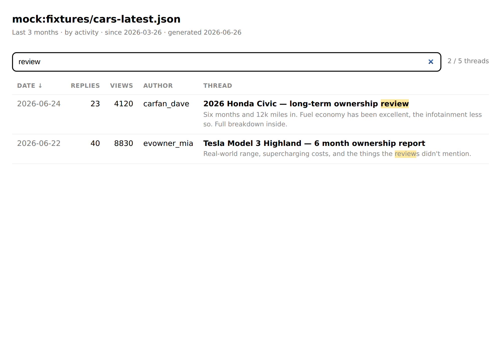

# forum-thread-extractor

Go to a forum, pull the **last N months** of threads (default 3), and turn them
into a **searchable list** — a terminal table, a JSON file, and a single
self-contained HTML page with a live search box.

Zero dependencies (just Node ≥ 18). First-class support for **Discourse**
forums, which expose clean JSON on every page by appending `.json` to the URL —
that makes scraping reliable instead of guessing at HTML.



## Install / run

```bash
node bin/forum-extract.js --help
# or, after `npm link`:
forum-extract --help
```

## What it does

Two modes:

1. **Thread list** (default) — the last N months of threads from a forum (or one
   category), newest first, ready to search.
2. **Single thread** (`--thread <id|url>`) — every post in one thread from the
   last N months.

```bash
# Last 3 months of threads -> out/forum.json + out/forum.html (searchable)
forum-extract https://forum.example.com --months 3 --out out/forum

# Only one category
forum-extract https://forum.example.com --category reviews/12 --out out/reviews

# One thread's recent posts
forum-extract https://forum.example.com --thread 12345 --months 3
```

### Options

| Option | Default | Meaning |
| --- | --- | --- |
| `--months <n>` | `3` | Window size |
| `--category <slug\|id>` | — | Restrict to a Discourse category |
| `--date-field activity\|created` | `activity` | Window by last activity or by thread creation |
| `--max-pages <n>` | `10` | Cap pages fetched (activity-sorted lists stop early) |
| `--limit <n>` | — | Cap rows printed to the console (full set still saved) |
| `--out <prefix>` | — | Write `<prefix>.json` and `<prefix>.html` |
| `--thread <id\|url>` | — | Single-thread mode |
| `--mock <file>` | — | Read a saved Discourse JSON instead of the network |
| `--now <ISO>` | now | Override "now" (reproducible windows / testing) |

The HTML output is **fully offline** — open it in any browser, type to filter by
title / author / category / excerpt, click a column header to sort, click a
title to open the thread.

## Safe forums to test on

These are real, public, **safe-content** Discourse forums (reviews / hobbies),
each with a clean `.json` API. Point the tool at the **root URL**:

| Topic | Forum (root URL) |
| --- | --- |
| Cars / EV ownership reviews | `https://forum.tesla-fans.io` style Discourse car forums (e.g. an EV-owners Discourse) |
| Home / DIY / renovations | `https://community.buildhub.org.uk` (UK self-build & renovation) |
| Movies / TV discussion | a Discourse film community such as `https://www.themoviedb.org`-linked forums |
| Photography gear reviews | `https://discuss.pixls.us` |
| General / software (very stable) | `https://meta.discourse.org`, `https://community.openai.com` |

Tip: to confirm a site is Discourse and scrapeable, open
`https://<forum>/latest.json` in a browser — if you get JSON, the tool will work.
Always respect each site's robots.txt / Terms of Service and keep request rates
polite (this tool fetches a few pages with a descriptive User-Agent).

## Offline demo (no network needed)

The repo ships sample Discourse JSON so you can see it work immediately:

```bash
npm run demo        # writes out/cars.json + out/cars.html from fixtures/
node bin/forum-extract.js --mock fixtures/cars-topic.json --thread 102 --now 2026-06-26
```

## Tests

```bash
npm test            # node --test, fully offline, uses fixtures/
```

## How it works

```
bin/forum-extract.js   CLI: arg parsing, output writing
src/http.js            fetch with timeout + retry + backoff (proxy-aware)
src/discourse.js       Discourse adapter: topic lists, posts, HTML→text
src/extract.js         date-window filtering (last N months), early-stop
src/render.js          console table, JSON index, self-contained HTML
fixtures/              sample Discourse JSON for the demo + tests
```

The Discourse adapter is the only forum-specific piece. To support another forum
engine, implement the same small interface (`fetchThreadPage`,
`fetchThreadWithPosts`) and the rest of the pipeline is reused.

## A note on network/sandbox environments

`forum-extract` uses Node's built-in `fetch` and sets `NODE_USE_ENV_PROXY=1` so
it honors `HTTPS_PROXY`. In locked-down environments an egress policy may block
forum hosts (you'll see `HTTP 403`); run it where the host is allowed, or use
`--mock` with a saved `latest.json`.
